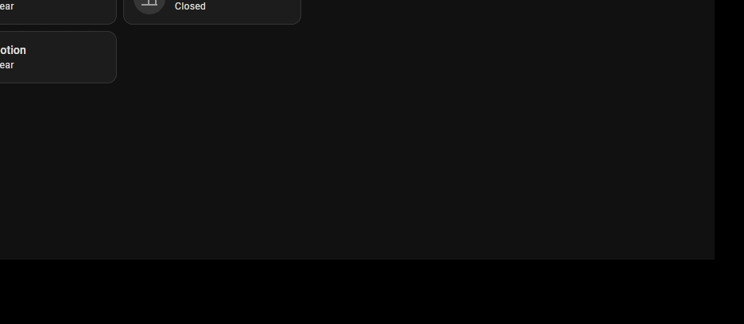
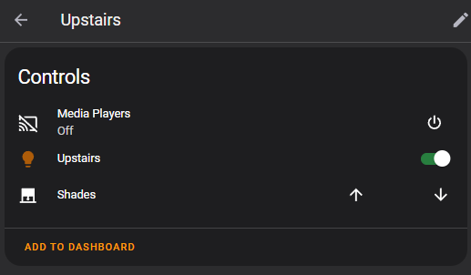
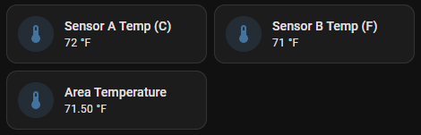

![Build Status][ci-status] [![GitHub Release][releases-shield]][releases] [![License][license-shield]](LICENSE) [![GitHub Last Commit][last-commit-shield]][commits]
![Project Maintenance][maintenance-shield] [![BuyMeCoffee][buymecoffeebadge]][buymecoffee]

![integration-usage-badge] [![Discord][discord-shield]][discord]

![ma-logo]

# Your areas so smart it's almost magic! 🪄

Magic Areas is a custom component for [Home Assistant](https://www.home-assistant.io/) that magically makes sense of the devices and entities in your areas so you don't have to! It's main purpose is tracking presence in your Home Assistant's areas but in reality it's much, much more than that.



### Multiple sources of presence

Motion-activated lights are so 2000s. Magic Areas tracks multiple sources of presence in order to gauge an area's `occupancy` state, which you can use on automations but as you'll see, you might not even have to.

Motion sensors, doors, media devices, device presence (`device_trackers`) are supported and you can use [Threshold](https://www.home-assistant.io/integrations/threshold/) and [Template](https://www.home-assistant.io/integrations/template/) binary sensors to track presence from power consumption and other entities' states!

In the demo on the left, the area gets cleared instantly for illustration purposes but in reality you can configure the timeout you want for an area to not receive any presence event before it gets marked as clear/not occupied.

The "Presence Hold" feature gives you a `switch` that is considered a source of presence and will let users hold an area `occupied` while the switch is `on`.



### Meta-areas

Magic Areas allows you to specify if an area is `interior` or `exterior` which allows it to create Meta-areas which groups all entities from said areas into their respective meta-areas.

Since the addition of `floors` to Home Assistant, Magic Areas now supports `floor` meta-areas in the same way as it does for the `exterior` / `interior` ones!

Some features (such aggregation and groups) are available for meta-areas which allows you to control all your lights, media player devices, covers and climate devices of exterior areas, interior areas or whole floors in a single place.

Meta-areas simplify things by allowing you to use their aggregate sensors such as "Interior Motion" and "Exterior Door" in your alarm setups, "Exterior Light" as your area light sensors and much more!



### Aggregate sensors

Group and automatically convert different unit sensors of the same `device class` together!

Aggregates are plain Home Assistant's [Groups](https://www.home-assistant.io/integrations/group/) and behave the same. Sensors of the same `device class` but with different `units of measurement` will be normalized and converted according to your unit system.

Even if you only have one sensor of each `device class`, aggregates allows you to reference a single entity on your auotmations while considering all others of the same `device class` but also allowing you to add new devices/entities to an area and having them automatically be considered in your automations that reference their aggregates.

### Light Groups

Probably the most utilized feature of Magic Areas, allows you to automatically control your areas' lights according an area's state. Would you like to have your overhead lights turned on when dark, but only your accent lights when watching TV unless you're sleeping then only a small light strip under your bed? Magic Areas got you covered!

Our light groups are also smarter, meaning when you change brightness or color, for example, in a Magic Light Group, unlike regular Light Groups, it won't turn on other lights member of the same group that are off, effecively allowing changes in a light group to affect only lights that are currently on!

When an area is clear or it gets bright, Magic Areas will take care of turning the lights off for you!

### Climate Groups

It (usually) doesn't make sense to have your fans running when you're not there, right? If you pair your fans with [Generic Thermostats](https://www.home-assistant.io/integrations/generic_thermostat), you can have Magic Areas turn your fans on (and off!) for you! A clever twist is that areas have an `extended` state and you can set your climate group to only turn on after you've been there for a while, to avoid them coming on when you're just passing by.

### Area-aware media player

Sending Text-to-speech notifications to media players is awesome, but sending notifications where no-one will hear isn't very smart and not magical at all. Area-aware media player is a media player group that will only forward `play` events to configured notification devices (i.e. media players) in areas that are currently `occupied`.

But wait, you won't wake up your kids! Magic areas allows you to specify states in which an area must be in order to receive notifications. Since Magic Areas supports a `sleep` state, if you leave that state out, areas that are sleeping won't be notified!

_And that's just the coolest ones, for all the features Magic Areas provides, check out the [wiki](https://github.com/jseidl/hass-magic_areas/wiki/Features)._

## Demo

Video coming soon!

## Installation

_Magic Areas_ is available on [HACS](https://hacs.xyz/)! For installation instructions check the installation [wiki](https://github.com/jseidl/hass-magic_areas/wiki/Installation).

## Configuration
Configuration options for `Magic Areas` are on a per-area basis.

> ⚠️ Before you start: Please make sure you understand all the **Concepts** on the [wiki](https://github.com/jseidl/hass-magic_areas/wiki).

> 💡 Light Groups won't control any lights unless the `Light Control` switch for that area is turned `on`!

Go to **Configuration** > **Integrations**. You shall see the *Magic Areas* integration and configure each area (and [Meta-Areas](https://github.com/jseidl/hass-magic_areas/wiki/Meta-Areas)!).

See all configuration options in the [wiki](https://github.com/jseidl/hass-magic_areas/wiki/Configuration).


## Magic Areas in your language!

Magic Areas has full translation support, meaning even your entities will be translated and is available in the following languages:
* English
* Spanish
* German
* Dutch
* Brazilian Portuguese

If your language isn't available and you would like to contribute, please check out the [language files](https://github.com/jseidl/hass-magic_areas/tree/main/custom_components/magic_areas/translations) and submit your language file on a pull request!

## Problems/bugs, questions, feature requests?

### Questions?

Come talk to me on the `#support` channel at my [Discord server](https://discord.gg/8vxJpJ2vP4) or pop up a question on our [Q&A Discussions page](https://github.com/jseidl/hass-magic_areas/discussions/categories/q-a)!

### Issues?

Please enable debug logging by putting this in `configuration.yaml`:

```yaml
logger:
    default: warning
    logs:
        custom_components.magic_areas: debug
```

As soon as the issue occurs capture the contents of the the log (`/config/home-assistant.log`) and open up a [ticket](https://github.com/jseidl/hass-magic_areas/issues) or join the `#support` channel on my [Discord server](https://discord.gg/8vxJpJ2vP4)!

### Feature requests

Please do not open issues for feature requests. Use the [Feature Request discussions area](https://github.com/jseidl/hass-magic_areas/discussions/categories/ideas-feature-requests) to contribute with your ideas!

## Contributions are welcome!

If you want to contribute to this please read the [Contribution guidelines](CONTRIBUTING.md)


***

[magic_areas]: https://github.com/jseidl/hass-magic_areas
[buymecoffee]: https://www.buymeacoffee.com/janseidl
[buymecoffeebadge]: https://img.shields.io/badge/buy%20me%20a%20coffee-donate-yellow.svg?style=for-the-badge
[commits-shield]: https://img.shields.io/github/commit-activity/y/jseidl/hass-magic_areas.svg?style=for-the-badge
[commits]: https://github.com/jseidl/hass-magic_areas/commits/main
[discord]: https://discord.gg/tvaS4BG5
[discord-shield]: https://img.shields.io/discord/928386239789400065?style=for-the-badge&label=Discord
[exampleimg]: example.png
[license-shield]: https://img.shields.io/github/license/jseidl/hass-magic_areas.svg?style=for-the-badge
[maintenance-shield]: https://img.shields.io/badge/maintainer-Jan%20Seidl%20%40jseidl-blue.svg?style=for-the-badge
[releases-shield]: https://img.shields.io/github/release/jseidl/hass-magic_areas.svg?style=for-the-badge
[releases]: https://github.com/jseidl/hass-magic_areas/releases
[ci-status]: https://img.shields.io/github/actions/workflow/status/jseidl/hass-magic_areas/validation.yaml?style=for-the-badge
[last-commit-shield]: https://img.shields.io/github/last-commit/jseidl/hass-magic_areas?style=for-the-badge
[ma-logo]: https://raw.githubusercontent.com/home-assistant/brands/master/custom_integrations/magic_areas/logo.png
[contributors-badge]: https://flat.badgen.net/github/contributors/jseidl/hass-magic_areas
[integration-usage-badge]: https://img.shields.io/badge/dynamic/json?color=41BDF5&logo=home-assistant&label=integration%20usage&suffix=%20installs&cacheSeconds=15600&url=https://analytics.home-assistant.io/custom_integrations.json&query=$.magic_areas.total&style=for-the-badge