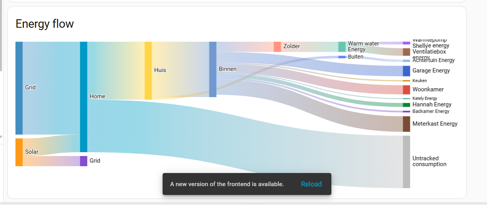

# ⚡Using energy aggregates with Home Assistant’s Energy Dashboard

When you enable **[Aggregation](../../features/aggregation.md)**, you get automatic sensor aggregates per area.
These aggregates include supported entities such as energy sensors, which makes feeding data into Home Assistant’s [Energy Dashboard](https://www.home-assistant.io/docs/energy/) a one-time setup — and then you never have to worry about adding every new device manually again.

## ❓ What problem does this solve

Every time you add a smart plug, a lamp, or any energy-reporting device, you’d normally need to:

- find the new entity
- add it to the Energy Dashboard manually

With **Aggregation**, you don’t need to do that.
When a device is assigned to an area, it’s automatically included in that area’s aggregate sensor.magic_areas_aggraggregate_egates_

Your dashboard stays up to date on its own.

## 🛠 How to use aggregates

1. Make sure **Aggregation** is enabled.
2. Ensure your devices expose energy consumption sensors.
3. Aggregates will appear automatically, e.g.:
   - `sensor.magic_areas_aggregates_living_room_aggregate_energy`
   - `sensor.magic_areas_aggregates_kitchen_aggregate_energy`
4. Add these Magic Area device to the Area (to enable hierarchical view). Magic Areas will not include it's own entities on its logic so it's safe.
5. In **Settings → Dashboards → Energy**, select these aggregate sensors instead of individual devices.

From this point on, any new energy-reporting device you add to an area is included automatically.

!!! tip
   You can still individually track devices, just select the Magic Area energy sensor as the `Upstream device` for those sensors in the energy configuration. This will visually let you know if you have untracked devices as Magic Areas' energy sensor will automatically start counting them and will show up on your dashboard as "untracked consumption".

## 👀 Things to keep in mind

- Devices must report compatible energy sensors (e.g. kWh or Wh).
- Watch for mixed units — that can cause confusing results.
- You can exclude devices from aggregation in area configuration if needed.

## ✅ Why use Aggregation

- **Less maintenance** → no more updating the dashboard when you add devices
- **Cleaner setup** → fewer entities to manage
- **Scales with your home** → works automatically as your system grows

## 🏁 Final thoughts

Aggregation gives you a reliable, hands-off way to track consumption across areas.
Once connected to the Energy Dashboard, it “just works” — accurate, simple, and always up to date.
